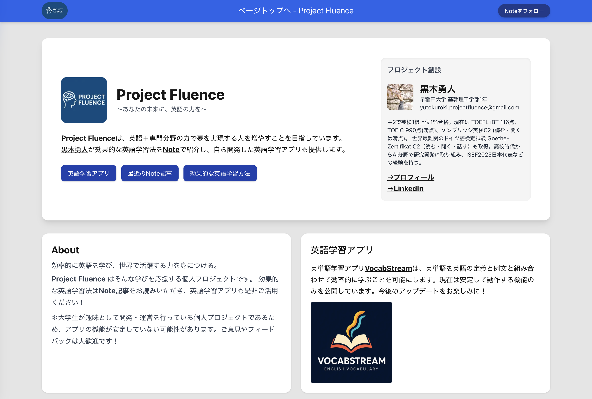

# Project Fluence (Frontend)

AI-powered English learning platform founded by **Yuto Kuroki**, designed to help learners achieve their goals through English proficiency combined with specialized skills.



🌐 **Live Site:** https://projectfluence.vercel.app  

---

## 🚀 Overview

This is a **Next.js-based frontend application** for **Project Fluence**. It serves as a landing page that provides:

- Practical AI-generated prompts for English practice  
- Exam preparation support (e.g., Eiken, TOEFL)  
- Writing feedback guidance  
- Educational content and external resources  

Project Fluence aims to help learners build English skills **alongside their personal interests and career goals**.

**Founder:**  
Yuto Kuroki  
- Eiken 1st Grade  
- TOEIC 990  
- TOEFL iBT 116/120  
- Advanced German  

---

## ✨ Features

### 🗣️ Interactive English Practice Prompts
- Copyable prompts for:
  - Everyday conversation  
  - Exam preparation  
  - Writing correction  
  - Vocabulary building  
- Supports levels from **A1 to C2**

### 📚 Educational Resources
- Links to Note articles on:
  - English learning strategies  
  - Exam success 
  - Multilingual learning tips  

### 🎨 Modern UI
- Built with **Next.js App Router** and **Tailwind CSS**
- Responsive design with a clean layout
- Sticky navigation banner

### ⚡ Performance & SEO
- Optimized for fast loading with Next.js
- Includes sitemap and metadata for SEO

---

## 🛠️ Tech Stack

- **Framework:** Next.js 15  
- **Language:** TypeScript  
- **Styling:** Tailwind CSS  
- **Analytics:** Vercel Analytics  
- **SEO:** next-sitemap  

---

## 🚀 Getting Started

### 1. Clone the repository
```bash
git clone <repository-url>
cd projectfluence
```

### 2. Install dependencies
```bash
npm install
```

### 3. Run the development server
```bash
npm run dev
```

Open http://localhost:3000 in your browser.

### 4. Build for production
```bash
npm run build
npm start
```

---

## 📁 Project Structure

```
projectfluence/
├── app/
│   ├── components/          # Reusable UI components (e.g., Banner.tsx)
│   ├── globals.css          # Global styles
│   ├── layout.tsx           # Root layout
│   ├── page.tsx             # Main landing page
│   └── privacy/             # Privacy policy page
├── public/
│   ├── images/              # Static assets (e.g., logo.png)
│   └── ...                  # Other assets (robots.txt, sitemap)
├── next.config.ts           # Next.js configuration
├── tailwind.config.js       # Tailwind CSS configuration
└── package.json             # Dependencies and scripts
```

---

## 📄 License

This project is **private and proprietary** to Yuto Kuroki.