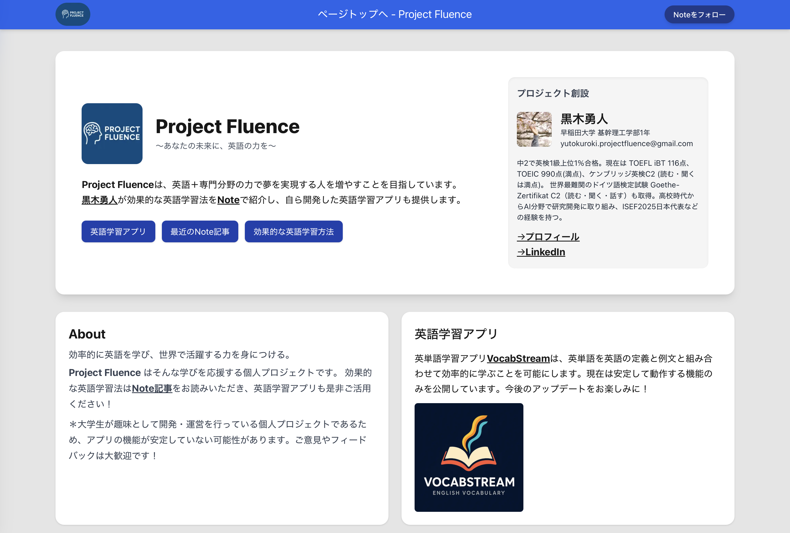

# Project Fluence

Project Fluence is an AI-powered English learning platform founded by **Yuto Kuroki**. It combines structured vocabulary study, AI-guided speaking and writing practice, and personalized video recommendations into one product suite for learners who want English to unlock academic, professional, and creative goals.



**Live site:** https://projectfluence.vercel.app

## Why This Exists

Most language-learning products either teach generic English or outsource all depth to a chat box. Project Fluence is built around a stronger idea: learners improve faster when AI practice, curated domain vocabulary, feedback, and real-world input are connected by the same learning context.

The current platform uses **Next.js on Vercel** for the frontend, **FastAPI on Render** for AI backend services, and **Supabase** as the data layer for recommendation content. The app hosts three learning surfaces:

- **VocabStream** - structured vocabulary and idiom lessons with quizzes, pronunciation support, progress-style scoring, and a 600-file static lesson corpus.
- **SpeakWiseAI** - AI conversation, lesson, feedback, rewrite, and text-to-speech flows powered by a FastAPI/OpenAI backend.
- **VidMatch** - YouTube-based listening recommendations backed by Supabase, quality scoring, filtering, protected ingestion, and Vercel cron.

## Product Surfaces

### VocabStream

VocabStream is the platform's structured study layer. It serves lesson JSON and prepared word-and-example audio from `public/vocabstream` and turns each lesson into a guided session with word cards, examples, meaning checks, sentence-completion quizzes, mistake replay, and scoring. Browser speech remains a fallback when an older saved reading has no prepared clip.

Supported content areas include:

- CEFR-aligned word sets: beginner, intermediate, advanced, and proficiency.
- CEFR-aligned idiom sets: beginner, intermediate, advanced, and proficiency.
- UI entry points for professional domains including computer science, medicine, business/economics, environment, law, politics, and engineering.

### SpeakWiseAI

SpeakWiseAI is the interactive practice layer. The frontend guides learners through level, topic, target test, skill, duration, and component selection, then calls the backend for AI tutoring responses and structured feedback.

Backend capabilities:

- Durable lessons with private PDF extraction/search, saved reading scripts, real VidMatch resource selection, and in-lesson canonical VocabStream practice. See the [capability audit](docs/speakwise-learning-audit.md), [setup and verification receipt](docs/speakwise-learning-operations.md), and [data migration guide](docs/speakwise-learning-data.md). Hosted migration/deployment and live-provider acceptance remain pending.
- Python `POST /api/learning/chat` generates validated replies/actions from owned, saved session records. Next.js `/api/speakwise/learning` executes catalog/vocabulary actions, and `/api/speakwise/lesson-sessions` saves state and finalizes evidence-based summaries.

- `POST /api/chat` for speaking, lesson, and warmup modes.
- `POST /api/feedback` for structured grammar, vocabulary, fluency, and suggestion feedback; a transcript alone cannot establish pronunciation quality.
- `POST /api/improved-version` for highlighted rewrites with segment-level change metadata.
- `POST /api/voice` for OpenAI text-to-speech audio.
- `GET /health` for uptime and deployment checks.

### VidMatch

VidMatch is the input-discovery layer. It helps learners find English videos that match their CEFR level, target skill, topic, accent preference, and caption needs.

The ingestion pipeline:

1. Protected Next.js route searches the YouTube Data API.
2. Video metadata is normalized into a typed `VidMatchVideo` shape.
3. A quality score is computed from captions, descriptions, tags, duration, views, and likes.
4. Qualified videos are upserted into Supabase PostgreSQL.
5. Recommendation routes query Supabase and apply learner-facing filters.
6. Vercel cron runs daily ingestion from preset searches.

## Architecture

```text
projectfluence/
+-- app/                         # Next.js App Router shell
|   +-- page.tsx                 # Project Fluence landing page
|   +-- layout.tsx               # metadata, analytics, global layout
|   +-- speakwise/[[...slug]]/   # mounts SpeakWise React app
|   +-- vocabstream/[[...slug]]/ # mounts VocabStream React app
|   +-- vidmatch/[[...slug]]/    # mounts VidMatch React app
|   +-- api/vidmatch/            # server routes for YouTube/Supabase workflows
+-- apps/
|   +-- speakwise/               # AI chat and lesson frontend
|   +-- vocabstream/             # vocabulary lesson frontend
|   +-- vidmatch/                # recommendation UI and ingestion service code
+-- api/
|   +-- speakwise/               # FastAPI backend for OpenAI chat, feedback, and TTS
+-- public/
|   +-- images/                  # brand and product assets
|   +-- speakwise/prompts/       # prompt templates
|   +-- vocabstream/data/        # static lesson corpus
+-- render.yaml                  # SpeakWise backend deployment
+-- vercel.json                  # Vercel cron configuration
+-- package.json                 # Next.js frontend scripts
```

The Next.js app acts as a host shell. Each product under `apps/*` owns its local routing and UI state, while catch-all App Router pages translate URL slugs into the pathname expected by the product app. This keeps each learning surface independently evolvable without splitting the platform into separate deployments.

## Tech Stack

- **Frontend:** Next.js 15, React 18, TypeScript, Tailwind CSS, deployed on Vercel.
- **Backend:** FastAPI, Uvicorn, Python, and the OpenAI API, deployed on Render.
- **Data:** Supabase Auth/PostgreSQL for profiles, progress, mistakes, SpeakWise sessions/memory and VidMatch catalog/history, plus the static JSON VocabStream corpus.
- **AI:** OpenAI chat completions for tutoring flows and OpenAI text-to-speech for generated audio.
- **External APIs:** YouTube Data API for VidMatch ingestion.
- **Platform Ops:** Vercel Analytics, `next-sitemap`, Vercel cron, Render health checks, and Supabase row-level security.

## Platform Architecture

Project Fluence is intentionally split into a small number of clear runtime boundaries:

- **Vercel frontend:** the Next.js app renders the landing page, mounts the three product surfaces, and hosts server routes for VidMatch ingestion and recommendations.
- **Render backend:** the SpeakWise FastAPI service owns AI tutoring, structured feedback, improved rewrites, text-to-speech, CORS, and health checks.
- **Supabase data layer:** VidMatch stores normalized YouTube metadata, quality scores, skill/topic tags, transcript availability, and recommendation filters in PostgreSQL.
- **Static learning content:** VocabStream lessons are served from versioned JSON files under `public/vocabstream/data`.

## Local Development

### Frontend

```bash
npm install
npm run dev
```

Open http://localhost:3000.

Useful routes:

- `/` - Project Fluence landing page
- `/vocabstream` - vocabulary and idiom learning app
- `/speakwise` - AI speaking and writing practice app
- `/vidmatch` - video recommendation app

### SpeakWise Backend

```bash
cd api/speakwise
python -m venv .venv
source .venv/bin/activate
pip install -r requirements.txt
uvicorn main:app --reload
```

Set the SpeakWise service URL explicitly in the Next.js environment (the browser uses it at build time):

```bash
NEXT_PUBLIC_SPEAKWISE_API_URL=http://127.0.0.1:8000
```

## Configuration

Runtime configuration is managed through local `.env` files and deployment provider dashboards. Do not commit API keys, service-role credentials, cron secrets, ingest tokens, or model-provider keys to this repository.

Configuration is split by runtime:

- **Next.js/Vercel:** public frontend settings, VidMatch server-route configuration, YouTube API access, Supabase connection details, ingestion protection, and cron protection.
- **FastAPI/Render:** OpenAI credentials, model selection, text-to-speech model selection, and allowed CORS origins.
- **Supabase:** PostgreSQL schema, row-level security policies, and service-role access for server-side ingestion and recommendation queries.

For local setup details, use the app-specific docs in `api/speakwise/README.md` and `apps/vidmatch/README.md`.

## VidMatch Data Setup

Apply the root `supabase/migrations` chain as described in [the Supabase guide](supabase/README.md). The per-app SQL files are historical snapshots, not the production migration entry point.

Ingestion runs through a protected Next.js server route. The route accepts a YouTube search query plus metadata such as CEFR level, target skills, topics, accent, result count, and minimum quality score. It then stores normalized, scored videos in Supabase.

Recommendations are exposed through:

```text
GET /api/vidmatch/recommend?level=B1&skills=listening&topics=travel&limit=6
```

## Engineering Opportunities

This codebase is early, product-driven, and full of high-leverage engineering problems:

- Build a durable learner model that connects VocabStream progress, SpeakWise feedback, and VidMatch recommendations.
- Replace heuristic video scoring with richer classification for CEFR level, accent, topic, transcript quality, and pedagogical usefulness.
- Expand the static vocabulary corpus into a typed content pipeline with validation, generation tooling, and editorial review.
- Improve observability across frontend events, backend AI calls, Supabase ingestion, latency, and recommendation quality.
- Introduce stronger testing around lesson flows, AI response schemas, route adapters, and ingestion edge cases.
- Evolve the app-shell architecture so each product can ship quickly while sharing auth, design primitives, analytics, and learner state.

## Scripts

```bash
npm run dev       # start Next.js locally
npm run build     # production build
npm run start     # start the production server
npm run postbuild # generate sitemap
```

## Frontend quality checks

The shared navigation and design tokens live in `app/components/AppHeader.tsx` and `app/globals.css`. Learning surfaces remain in `apps/*`; scoped styles and shared learning components keep their workflows cohesive.

- [Frontend audit, route map, and refinement priorities](docs/frontend-refinement.md)
- [Responsive and workflow validation, with reproducible commands](docs/frontend-validation.md)

Run `npm run lint`, `npm run typecheck`, `npm run test:frontend`, and `npm run build`. Browser validation also covers the learning workflows and widths from 320 to 1920 px.

## Deployment

- Follow [the production deployment guide](docs/production-deployment.md) for exact Render services, environment ownership, Supabase migrations/Auth, deployment order, and smoke tests.
- `render.yaml` supports Next.js + FastAPI + the daily ingestion cron on Render. The existing Vercel frontend + Render FastAPI topology is also documented. Run only one scheduler.
- Apply the canonical [root Supabase migration chain](supabase/README.md) before deploying the updated API. Per-app SQL files are historical snapshots.
- Review [the backend audit and validation evidence](docs/backend-audit.md) for architecture, fixes, and limits of local verification.

## License

This project is private and proprietary to Yuto Kuroki.
