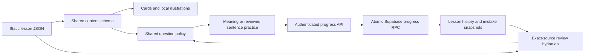

# VocabStream curriculum and compatibility audit

This document records the initial implementation at commit `3b5cc04`. For subsequent lesson numbering, content expansion and current validation, see [the expansion report](vocabstream-expansion.md).

## Scope and architecture

This update extends `codex/vidmatch-curated-catalog`. It does not merge into main, apply hosted migrations, or modify live learner records. It is safe to prepare before deployment; the existing branch's Supabase setup is still required for authenticated progress.

The complete original corpus was inspected: **600 JSON lessons / 5,999 entries**. All **3,999 word entries** received a semantic reading of the headword, English definition, Japanese gloss and example, followed by bounded corrections. The other 2,000 entries were copies of the same ten-word idiom scaffold. All 380 new entries received a second content/distractor review. This is an editorial pass by the coding agents, not independent teacher validation or calibrated CEFR testing.

There is no vocabulary-generation worker or LLM call in this path. Browser speech synthesis reads words and examples. Review is based on stored mistakes, with up to 20 meaning and 20 sentence questions; it is not a spaced-repetition scheduling algorithm.

## Progress compatibility

The application uses route-derived lesson IDs such as `word-beginner-lesson-1`, course/category, lesson number and word text. Legacy JSON `lesson_id` strings are not the persisted lesson key. Supabase mistake records are unique by `(user_id, source_category, lower(word))`; repeated same-course headwords can already share one mistake record.

Preserved:

- All 600 original paths and JSON lesson IDs.
- All 5,999 original word strings, array positions and level/course membership.
- Existing question types (`meaning`, `quiz`), attempt UUID retries and database keys.
- Historical attempts, scores and mistake counts. A later reattempt naturally records its current question totals; old attempts are not recalculated.

No progress migration is required. A committed baseline guards the original identities. Existing internal ID collisions and the nine-word proficiency Lesson 100 were deliberately retained. The duplicate `turmoil` in proficiency Lesson 42 remains in its original positions; question generation already collapses duplicate spellings within a lesson.

Review now resolves the **exact source lesson**, instead of attaching whichever matching category/headword was last loaded from disk. It uses corrected current content when that source is unambiguous. Unresolvable historical records retain their text and receive no borrowed image or invented sentence gap. This improves presentation without rewriting history.

## Assessment and content findings

The original generator selected random neighboring words and replaced the first matching substring in an example. This made alternatives such as several foods valid in “I eat ____ for breakfast.” It could also blank a target inside another word, and the review service fabricated a blank when the target was absent.

Both lesson and review now use one policy:

- Scored sentence questions require `sentencePractice`: exactly one blank, two reviewed distractors and an editorial explanation.
- **80 reviewed sentence exercises** were checked with the intended answer and both alternatives inserted. Two ambiguous contexts were tightened in a second pass; several grammatical throwaway alternatives were replaced.
- All other examples remain study content. **6,299 entry occurrences have no scored sentence question**; this includes retained scaffold copies. The UI shows the available stages and does not report a fictitious zero-question score.
- New content has explicit meaning distractors. Fifteen near-synonym or broad/subtype pairs were corrected during independent review. Legacy meaning fallback excludes duplicate labels, identical English/Japanese meanings and listed synonyms in either direction; it cannot prove semantic uniqueness.
- Progress requests reject duplicate choices after Unicode/case/whitespace normalization.

Corrections include `apple → fruit` being incorrectly labeled a synonym, `keyboard ↔ screen` and `fork ↔ spoon` being labeled antonyms, 67 literal `none` placeholders, a wrong Japanese gloss for `bipartisan`, noun/verb mismatches, inaccurate scientific claims, and unnatural collocations. Beginner improvements include a distinguishing definition for `cat`, a below-ground definition for `basement`, an appropriate example for `healthy`, and simple usage notes for rare/formal terms and singular/plural forms.

The final source comparison records **411 original entries changed or annotated across 164 files**: 89 English definitions, 57 examples, 24 Japanese glosses, 153 synonym fields and 224 antonym fields, plus the optional image/practice/usage/duplicate metadata. Counts overlap within entries; they are actual field changes, not claims of hundreds of independent factual errors. All remaining original files are unchanged. The [advanced-level review](vocabstream-advanced-semantic-review.md) records its precise corrections and limits.

There is **no broad CEFR reshuffle**. Some inherited beginner entries remain unusually advanced or uncommon, such as `kindheartedly`, `leftward` and `unready`. Notes offer common alternatives while preserving their placement. Strong existing definitions/examples were retained.

## Images

| Course | Image + text entries | Image-only entries |
|---|---:|---:|
| Word beginner | 30 | 0 |
| Word intermediate / advanced / proficiency | 0 each | 0 |
| Expressions and specialist courses | 0 | 0 |

The selected senses are recognizable foods, utensils, clothing and school objects: apple, banana, carrot, bread, spoon, shirt, pencil, ruler and backpack, for example. Abstract words and context-dependent relationships remain text-based. Image support is reusable and optional; existing text-only JSON still works.

The 30 original SVG illustrations total approximately **25 KB**. They are local, responsive, have intrinsic dimensions and Japanese alternative descriptions, and use no external image service or hotlink. A failed image is replaced with its Japanese description, and the next image does not inherit the previous error. Images are the primary question prompt; definitions and useful examples remain on cards and in answer feedback.

Creator/source/license metadata is stored per image and in [the manifest](../public/vocabstream/images/manifest.json). Original artwork is released under [CC0 1.0](https://creativecommons.org/publicdomain/zero/1.0/); [the attribution file](../public/vocabstream/images/ATTRIBUTION.md) defines its scope. No third-party photos were downloaded or copied.

## Genuine expression courses

All 200 old idiom lessons contained the same ten single words. Replacing those files would have attached existing scores to entirely different material. They remain accessible as “以前のレッスン,” with their history. The main idiom lists now start at **Lesson 51** and contain five new ten-entry lessons per level.

| Level | Added | Content and examples |
|---|---:|---|
| Beginner A1–A2 | 50 | Daily routines, home actions, travel, shopping, polite conversation: `get up`, `take off`, `on time` |
| Intermediate B1 | 50 | Relationships, study, home, travel, opinions: `keep in touch`, `hand in`, `just in case` |
| Advanced B2 | 50 | Discussion, work, decisions, change, conversational imagery: `back up`, `take into account`, `break the ice` |
| Proficiency C1–C2 | 50 | Evidence, implementation, negotiation, risks and interpretation: `bear out`, `strike a balance`, `read between the lines` |

Each expression is labeled as a phrasal verb, collocation, fixed expression or idiom. British/American usage and variable-object patterns are explained where useful. Levels are approximate course targets, not a claim that every expression is exclusive to that CEFR band.

## Specialist courses

| Domain | Added | Topics |
|---|---:|---|
| IT / computers | 30 | Systems/data, programming, security/operations |
| Engineering | 30 | Forces, electrical/control systems, design/manufacturing |
| Healthcare | 30 | Symptoms/treatment, care communication, tests/recovery |
| Business / economics | 30 | Accounts, meetings/transactions, markets/operations |
| Environment | 30 | Ecosystems, climate/energy, resources/water |
| Academic English | 30 | Study design, interpreting data, scholarly writing |

Every entry has an original plain-English definition, Japanese gloss, example and explicit meaning choices. Selective usage notes distinguish technical senses (`stress`, `fatigue`, `current`, `minutes`) and common misconceptions (`correlation`, `confidence interval`, `invasive species`). These courses teach useful field vocabulary, not professional advice or exhaustive technical dictionaries. They share the same components, answer validation, progress API and review system.

## Conservative duplicate handling

The original word-course headword counts are 948 beginner, 999 intermediate, 841 advanced and 871 proficiency. Repetition includes legitimate inflections and distinct senses; spelling alone is not a deletion rule. **23 reviewed same-sense repeats** now point to an earlier canonical entry using `duplicateOf`. Cards link to the original lesson. These are study references, not destructive database merges. Other uncertain overlaps remain documented for an educator-led curriculum decision.

## Reusable quality controls

`npm run vocabstream:audit` checks every JSON entry, required fields, original identities/order, explicit option structure, image assets/provenance and canonical references. The full-corpus generator test ensures reviewed questions and images are actually emitted and their answer indices are valid. Course tests verify that every advertised route has data and that archive state cannot empty a word course.

`npm run vocabstream:ambiguity -- --output /tmp/ambiguity.json` exports the intended and alternative completed sentences with review reasons. Static checks catch malformed gaps and known synonymous options; `unique_answer: null` honestly leaves semantic judgment to a reviewer. `--include-study` lists unreviewed examples. No external LLM subscription or private content upload is needed.

Both audits run automatically before the production build. Additions should be checked in the UI and linguistically reviewed as well as passing these checks. See [the authoring guide](../apps/vocabstream/README.md).

## Validation performed

All checks below ran locally against the final implementation with Node 22. Browser and API checks used a production Next.js build with synthetic credentials and isolated fixtures; no hosted learner data was used.

| Check | Result |
|---|---|
| `npm test` | 107 passing tests: 22 frontend/content and 85 backend |
| `npm run typecheck` | Passed |
| `npm run lint` | Passed, no errors or warnings |
| `npm run build` | Passed, including both content audits, compilation and static generation |
| Dataset audit | 638 files / 6,379 entries, all 5,999 original identities/order preserved, zero errors |
| Sentence audit | 80 reviewed exercises, 6,299 study-only entry occurrences, zero structural errors |
| `scripts/validate-database.mjs` | 26 checks passed using isolated PostgreSQL/WASM (PGlite), including real progress RPC writes, idempotent retries, unchanged historical rows and owner isolation |
| `scripts/validate-vocabstream-api.mjs` | 4 checks passed against actual local Next.js routes with a local Supabase HTTP fixture |
| `scripts/validate-vocabstream-curriculum.mjs` | 66 card/question/viewport checks at 320, 768 and 1,440 px, no Axe violations or horizontal overflow; complete lessons, save/readback fixtures, archive navigation and image failure recovery passed |
| `scripts/validate-vocabulary.mjs` | Perfect/final-answer scoring, 95% mistake replay, duplicate-click prevention, keyboard focus, responsive layouts up to 1,920 px, guest/auth fixtures and missing-lesson handling passed |
| `scripts/validate-learning-saves.mjs` | Session refresh preserves review, failed-response retry reuses the same batch identity, and guest learning makes no writes |

Browser runs recorded no page errors or unexpected external requests. Server logs contained only expected invalid-session and invalid-progress failures deliberately exercised by fixtures. Screenshots of the beginner image exercise, specialist cards and idiom cards were also visually inspected. Node's direct TypeScript test runner emits the existing module-type inference warning; this does not affect the successful Next.js build.

The review generator now stops after its question quotas are filled and groups category pools once. A local 500-mistake generation sample fell from about 1,240 ms to 50 ms. A separate full-catalog hydration-plus-generation sample took 152 ms. These are local diagnostic measurements, not production latency guarantees.

## Deployment scope and remaining limits

Deploy this branch's Next.js code and public lesson/image files together after completing [the existing deployment guide](production-deployment.md). There are **no new VocabStream migrations, environment variables, storage buckets, workers or external credentials**. The production review route's build trace was checked to include all 638 lesson JSON files, including the new courses, using the existing Next.js [file tracing behavior](https://nextjs.org/docs/15/app/api-reference/config/next-config-js/output).

Remaining work is editorial/product work: independent teacher/learner trials, calibrated CEFR placement, more reviewed sentence exercises and illustrations, and a deliberate policy for deduplicating legacy lessons without conflating distinct senses or losing history. The old meaning fallback still depends on the quality of recorded definitions/synonyms. Physical iPhone/iPad/Android and Safari testing remains a post-deployment check; local browser tests do not certify those devices. Live sign-in and hosted persistence must be smoke-tested after deployment. No live learner account was altered for testing.
